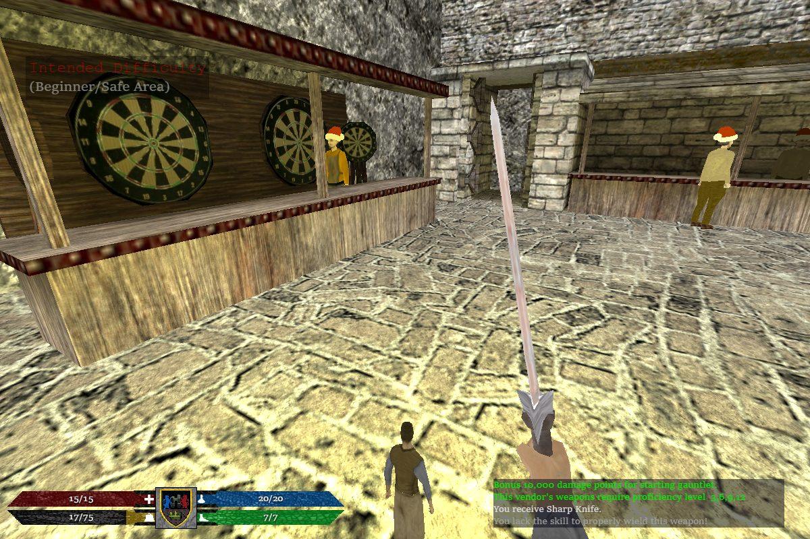
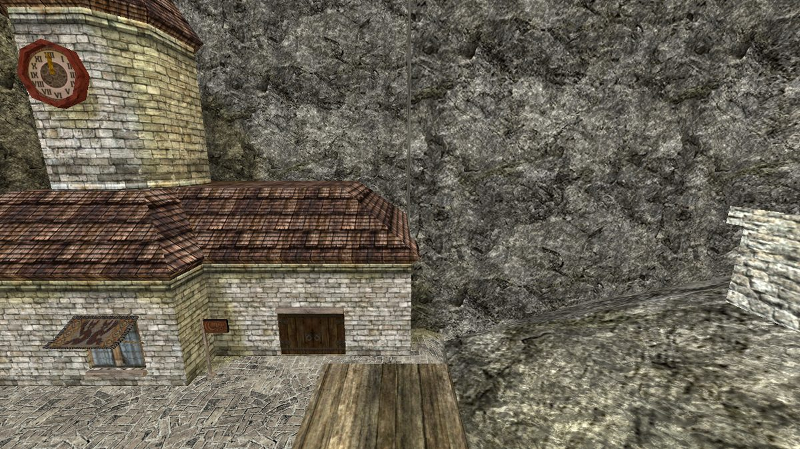
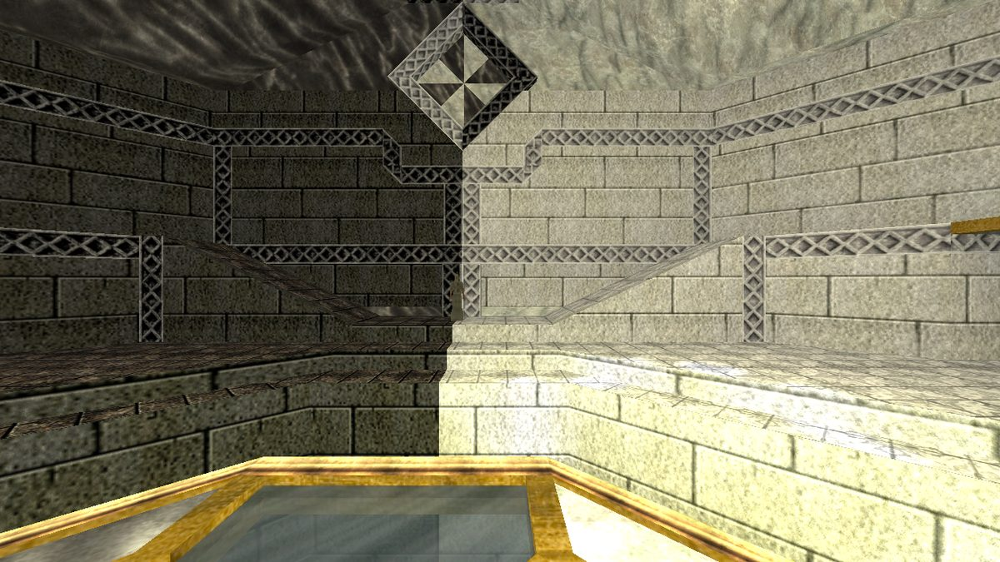

# Master Sword: Rebirth — in Three.js

<!-- insignias:inicio -->


<!-- insignias:fin -->

An **unofficial fan port** of two towns from *Master Sword: Rebirth* —
**Gate City** and **Edana** — to the browser. Three.js and Rapier, no game engine
in between: the real `.bsp` maps, the real models, the real NPC scripts.

It is also an **experiment in AI-assisted porting**. The work was done with
**Claude (Opus 5.5)** in Claude Code: reading the mod's C++ and its 2,884 scripts,
and porting them rule by rule. Every ported rule cites the file and line it came
from. When something could not be cited it was measured, and the measurement was
written down — including the many times the measurement turned out to be wrong.
That notebook is in [`doc/`](doc/), in Spanish.



| | |
| --- | --- |
|  |  |

## What works

- **The maps** — the `.bsp` read directly: BSP tree, WAD textures, baked
  lightmaps and light styles, the sky.
- **Movement and combat** with the mod's own numbers: swings and charged
  attacks, parry, shields, bows, criticals.
- **NPCs** — models and animations from the `.mdl`; their AI runs on the server;
  their scripts run on an interpreter written for this port.
- **Talking, trading and quests** — the townsfolk's menus, the merchants, and
  Edana's cider quest from start to finish.
- **The character** — stats, the six skill schools, experience, inventory,
  quickslots, saving.
- **The interface** — the original VGUI panels (character sheet, options, server
  browser), rebuilt in the DOM.
- **Multiplayer** — a Node server with server-side creatures, up to 32 players.
- **Desktop** — an Electron build that runs without Node.

## What it isn't

Two towns, not the game. Leaving them is not ported: the map transitions to the
Thornlands and the sewers lead nowhere yet. The bars above say how much of each
piece is done, and they are measured, not estimated — see below.

## No game content in this repository

Not one texture, model, sound or map. Everything the game needs is read from a
copy of the game's content that **you** put next to this folder, and extracted
into `build/`, which is never committed. [A test](test/procedencia.test.mjs)
enforces that. The only images here are the three screenshots above, and the
same test keeps them to that folder and that size.

Not affiliated with, endorsed by, or supported by the Master Sword: Rebirth team.
All game content is theirs; see [CREDITOS.md](CREDITOS.md).

## Running it

You need Node 20+ and the game's content, which the MSR team publishes:

```bash
# 1. the game's content, in a folder called MSC next to this one
mkdir ../MSC && cd ../MSC
git clone https://github.com/MSRevive/assets.git
git clone https://github.com/MSRevive/MSCScripts.git
cd -

# 2. this
npm install
npm run hornear     # extracts what the game needs into build/ — a few minutes
npm test

# 3. play
npm run dev         # http://localhost:5173/
npm run servidor    # optional: the multiplayer server
```

## How the bars are measured

Each one is computed by [`tools/insignias.mjs`](tools/insignias.mjs) —
`npm run insignias` rewrites them — and
[a test](test/insignias.test.mjs) fails if this page disagrees with today's
measurement. Percentages are rounded **down**.

| bar | what it counts |
| --- | --- |
| script commands | the mod's script commands — all three of its tables, commented-out ones excluded — that the interpreter implements |
| Edana scripts, Gate City scripts | the town's NPC scripts that run **entirely** on what is implemented |
| NPC menus | of every NPC in the mod that has a menu, those that can build it entirely |
| options, create server | the rows of those two windows that actually do something |

Regenerating the bars also needs the mod's source next to the content:
`git clone https://github.com/MSRevive/MasterSwordRebirth ../MSC/MasterSwordRebirth-Xash3D`.

## Reading further

- [CLAUDE.md](CLAUDE.md) — how the work is done here, and the mistake it kept
  making (section 4 is the interesting one).
- [`doc/`](doc/) — one document per experiment: what was measured, and what was
  misunderstood.
- [CREDITOS.md](CREDITOS.md) — whose work each piece is.

## Licence

The code in this repository is ours. The game content is not, and is not here.
Distributing the *content* — serving a baked map from a web server — needs
permission that has not been asked for, from the MSR team for their assets, from
DrKill for Gate City itself, and from Valve for what Half-Life's SDK covers. What
is published is the code.
